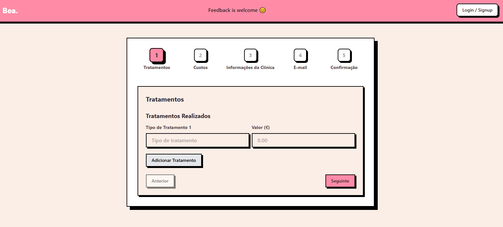

# BeaApp



## Descrição

BeaApp é uma aplicação web moderna desenvolvida com Next.js 15+ que oferece uma experiência de utilizador intuitiva e visualmente apelativa. A aplicação utiliza uma paleta de cores suaves e acolhedoras com tons de rosa, bege e cinzento, criando uma atmosfera convidativa para os utilizadores.

## Funcionalidades

- **Autenticação de Utilizadores**: Sistema completo de login e registo com suporte para autenticação via Google
- **Interface Responsiva**: Design totalmente responsivo que funciona em dispositivos móveis, tablets e desktops
- **Componentes Personalizados**: Botões e elementos de interface com estilo "neumorphic" únicos
- **Gestão de Estado**: Utilização de Context API para gestão de estado global da aplicação
- **Integração com Supabase**: Backend como serviço para autenticação e armazenamento de dados

## Tecnologias Utilizadas

- [Next.js 15+](https://nextjs.org/) - Framework React para produção
- [TypeScript](https://www.typescriptlang.org/) - Superset tipado do JavaScript
- [Tailwind CSS](https://tailwindcss.com/) - Framework CSS utilitário
- [Supabase](https://supabase.io/) - Backend como serviço (autenticação, base de dados)
- [React](https://reactjs.org/) - Biblioteca para interfaces de utilizador

## Requisitos

- Node.js 18 ou superior
- npm, yarn ou pnpm

## Instalação

1. Clone o repositório:

   ```bash
   git clone https://github.com/Duarte-Verissimo/BeaApp.git
   ```

2. Navegue até ao diretório do projeto:

   ```bash
   cd BeaApp
   ```

3. Instale as dependências:

   ```bash
   npm install
   # ou
   yarn install
   # ou
   pnpm install
   ```

4. Configure as variáveis de ambiente:
   Crie um ficheiro `.env.local` na raiz do projeto com as seguintes variáveis:

   ```env
   NEXT_PUBLIC_SUPABASE_URL=sua_url_do_supabase
   NEXT_PUBLIC_SUPABASE_PUBLISHABLE_KEY=sua_chave_publicável_do_supabase
   ```

5. Inicie o servidor de desenvolvimento:

   ```bash
   npm run dev
   # ou
   yarn dev
   # ou
   pnpm dev
   ```

6. Abra [http://localhost:3000](http://localhost:3000) no seu browser.

## Estrutura do Projeto

```
├── app/                    # App Router do Next.js
│   ├── auth/              # Páginas de autenticação
│   ├── actions/           # Server Actions
│   └── ...
├── components/            # Componentes React reutilizáveis
│   ├── auth/              # Componentes de autenticação
│   ├── ui/                # Componentes de interface
│   └── ...
├── contexts/              # React Contexts
├── lib/                   # Funções utilitárias
├── public/                # Ficheiros estáticos
├── services/              # Serviços da aplicação
├── utils/                 # Utilitários
│   └── supabase/         # Configuração do Supabase
└── ...
```

## Comandos Disponíveis

- `npm run dev` - Inicia o servidor de desenvolvimento
- `npm run build` - Compila a aplicação para produção
- `npm run start` - Inicia o servidor de produção
- `npm run lint` - Executa o linter para verificar erros

## Contribuição

1. Faça um fork do projeto
2. Crie uma branch para a sua feature (`git checkout -b feature/AmazingFeature`)
3. Faça commit das suas alterações (`git commit -m 'Add some AmazingFeature'`)
4. Faça push para a branch (`git push origin feature/AmazingFeature`)
5. Abra um Pull Request

## Licença

Este projeto está licenciado sob a licença MIT - veja o ficheiro [LICENSE](LICENSE) para detalhes.

## Contacto

Duarte Veríssimo - [@Duarte-Verissimo](https://github.com/Duarte-Verissimo)

Link do Projeto: [https://github.com/Duarte-Verissimo/BeaApp](https://github.com/Duarte-Verissimo/BeaApp)
